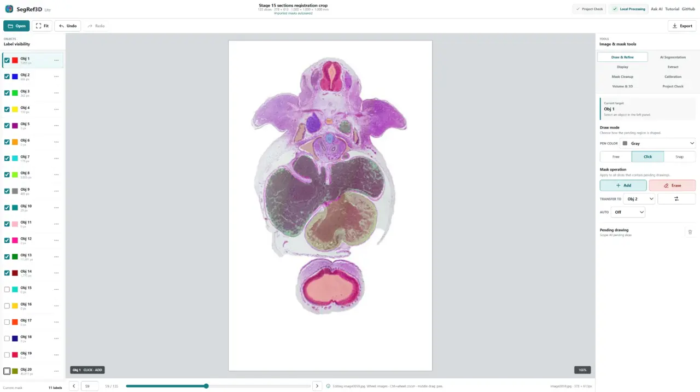
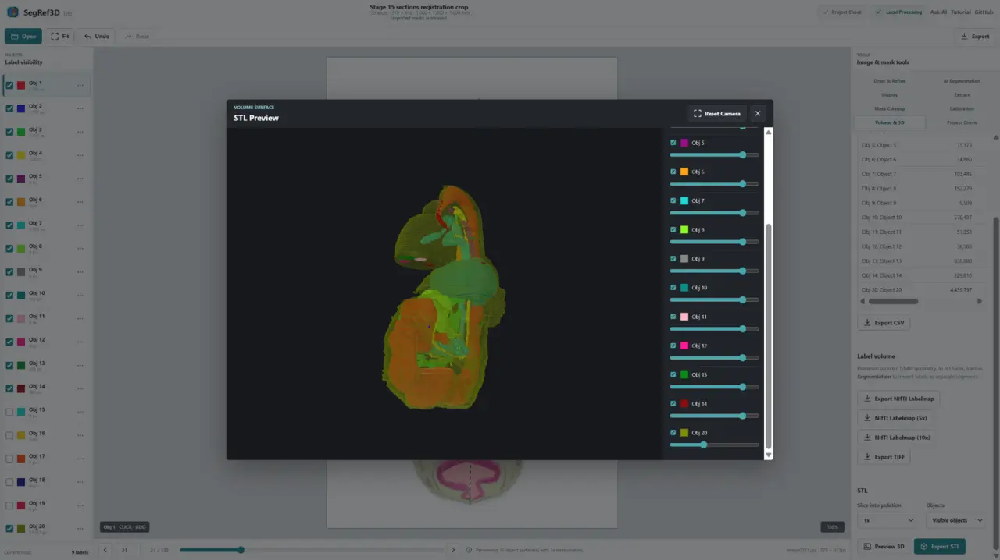

# SegRef3D

**From image stacks to quantitative 3D data.**

SegRef3D helps researchers segment structures, refine masks, measure calibrated volumes, and
reconstruct 3D models from serial images and volumetric data.

[**Open SegRef3D Lite**][lite] · [**Local GPU v1.3.2 release information**][gpu-download] ·
[Tutorial](Tutorial/TutorialSegRef3DLiteEN.md) · [Ask AI](Tutorial/AskAISegRef3D.md) ·
[日本語](READMEJP.md)

  
  

## Start with your images

| Your data | What SegRef3D can help you do |
| --- | --- |
| Serial histology / optical microscopy | Segment structures, refine masks, measure calibrated volume, and reconstruct 3D. |
| Serial electron microscopy | Work across an ordered image stack, quantify labeled structures, and reconstruct them. |
| CT / MRI | Load volumetric data, segment or refine structures, measure volume, and export 3D data. |
| Micro-CT | Use known voxel spacing for quantitative segmentation, measurement, and reconstruction. |
| Visible Human / anatomical image stacks | Segment anatomical structures from ordered images and create quantitative 3D data. |
| Existing masks / AI segmentation | Import masks, refine them, measure the result, and export it for further analysis. |

Serial physical sections may require [registration](Tutorial/Registration.md) before quantitative 3D
analysis. Reliable pixel/voxel and slice spacing are essential for physical measurements.

## Demo datasets

SegRef3D Lite includes two microscopy image stacks that load directly in the browser:

- **Electron microscopy:** HeLa cells, EMPIAR-10478 (CC0), 150 slices, 512 × 512, 25.4 MB.
- **Mouse brain — Light microscopy:** Brain Architecture Project (BAP), 132 serial sections,
  707 × 553, 51.5 MB, redistributed under CC BY-SA 4.0.

Choose a demo on the start screen or in **Open**. Apple and RabbitCT demos also remain available.
Demo images download only when selected. Your own images are processed locally during normal use.
See [demo data licenses, citations and modifications](lite-web/demo/DEMO_DATA_LICENSES.md).
These data licenses are separate from SegRef3D's Apache-2.0 software license.

## What do you want to do?

- **Segment** a structure in serial images or a volume.
- **Refine** an existing manual or AI-generated segmentation.
- **Measure** calibrated object volume.
- **Reconstruct** and inspect a 3D structure.
- **Export** masks, label volumes, measurements, or surface models for further analysis.
- **Export Training Data ZIP** with geometry-matched image channel(s), labelmap, and a versioned
  manifest for custom segmentation-model training.
- **[TrainRef3D](train-web/README.md)**: assemble Training ZIPs locally, select one target,
  and train a binary custom model in your own Colab GPU runtime. Research baseline, not clinical validation.
- **InferRef3D / Custom Model**: validate that Model ZIP in SegRef3D Lite, create a source-bound
  request, run GPU inference in your own Colab runtime, then import the prediction for review,
  correction, and another Training Data ZIP. See the [inference contract](docs/TRAINREF3D_INFERENCE_FORMAT.md).

## Why SegRef3D?

### Built for image stacks and volumes

Use one workflow for serial histology, microscopy, CT/MRI, micro-CT, other ordered images, and
supported 3D volumes: **segment → refine → quantify → 3D**.

### Human in the loop

SegRef3D is designed around **Create → Train → Predict → Review & Correct** as well as
**AI segmentation → researcher refinement → quantitative output**.
Automatic results remain editable before measurement or reconstruction.

### Quantitative 3D

SegRef3D connects calibrated spacing and reviewed masks to volume statistics, NIfTI labelmaps, TIFF
stacks, and STL surface models.

Saved mask PNG sequences use the displayed canonical volume order: volume z=0 is `mask0001.png`
and volume z=N-1 is `maskNNNN.png`. New SegRef3D mask sets include
`segref3d-mask-manifest.json` declaring `segref3d-canonical-v1` ordering.

### Local first

Normal SegRef3D Lite editing, measurement, and export run in your browser. Optional Colab-based AI
workflows upload data only when you explicitly submit a job. Check your institution's policy before
uploading research or medical data.

AI-assisted segmentation is available through local or optional Colab-based workflows. Results can
be refined in SegRef3D before quantitative analysis or 3D export.

## Choose your SegRef3D

| Version | Best for | Start |
| --- | --- | --- |
| **SegRef3D Lite** | Most users; Windows, macOS, or Linux; no installation | [**Open in browser**][lite] |
| **SegRef3D Local GPU v1.3.2** | Windows + compatible NVIDIA CUDA GPU; local SAM2 | [**Release information**][gpu-download] |
| **SegRef3D Local CPU v1.2.6** | Windows CPU-only/offline desktop legacy workflow | [**Download ZIP**][cpu-download] |

Start with **SegRef3D Lite** unless you specifically need a Windows desktop build. Choose Local GPU
to run the included SAM2 workflow locally. Local CPU is a legacy/fallback option without local SAM2.

Local GPU v1.3.2 provides local SAM2 box-prompt segmentation and multi-frame tracking. It uses
PyTorch 2.11.0+cu128 (CUDA 12.8) and supports RTX 50-series / Blackwell `sm_120`.
The previous GPU runtime was verified on an RTX 5080 Laptop GPU; real-GPU SAM2
validation of this v1.3.2 ZIP remains a follow-up. A compatible NVIDIA GPU is required.

Local v1.3.0 also includes Interpolate Between Frames; Preview 3D and STL export with 1x, 5x, or 10x
slice interpolation; PNG and legacy SVG mask import; Label PNG and colored SVG mask export; and
session-based autosave storage.

For a Local build: download the ZIP, extract the complete folder, and run `SegRef3D.exe`. See the
[Local installation guide](Tutorial/LocalInstallation.md) for driver, folder, and startup notes.

## Ask AI about your workflow

Not sure where to start? Tell the AI **what images you have → what you want to achieve → your
computer environment**, then receive a recommendation based on the official SegRef3D documentation.

[**Ask ChatGPT, Gemini, Claude, or Perplexity using the official prompt**](Tutorial/AskAISegRef3D.md)

Describe conditions and non-sensitive metadata only. Do not paste confidential research images or
identifiable patient information into a third-party AI service.

## Tutorials

| I want to... | Guide |
| --- | --- |
| Get started with SegRef3D Lite | [Basic tutorial](Tutorial/TutorialSegRef3DLiteEN.md) |
| Watch the SegRef3D Lite workflow in Japanese | [SegRef3D Lite 使い方解説｜AIセグメンテーションから3D表示まで](https://youtu.be/V0WZmJSZHgg) |
| Watch the basic workflow | [Tutorial video](https://youtu.be/JModwfnBTYU) |
| Learn the complete desktop workflow | [Full SegRef3D tutorial](Tutorial/TutorialSegRef3DEN.md) |
| Work with serial histology | [Registration / serial section guide](Tutorial/Registration.md) |
| Use AI for arbitrary structures | [Seg Anything tutorial](Tutorial/TutorialSegOnWebEN.md) |
| Segment supported CT/MRI anatomy | [Seg CT/MRI workflow](lite-web/README.md#seg-ctmri-workflow) |
| Choose NIfTI, TIFF, STL, or CSV output | [Lite export tutorial](Tutorial/TutorialSegRef3DLiteEN.md#11-choose-an-export) |
| Install a Windows Local edition | [Local installation guide](Tutorial/LocalInstallation.md) |

[View the release history](CHANGELOG.md) · [Legacy downloads](Tutorial/LegacyDownloads.md) ·
[AI-readable documentation](llms.txt)

## Troubleshooting: Windows 11 blocks an internal PYD

The current Local GPU distribution is unsigned and may show `VTK preview unavailable`,
`DLL load failed while importing vtkInteractionStyle`, or “blocked by an application control policy”
(「アプリケーション制御ポリシーによってこのファイルがブロックされました」)
when Smart App Control blocks an internal `.pyd`. In Event Viewer, check
`Microsoft → Windows → CodeIntegrity → Operational` for the affected file and time.
The reported event identified `vtkInteractionWidgets.cp312-win_amd64.pyd` as not meeting
Enterprise signing level requirements. An antivirus allowing the EXE does not
necessarily allow its DLL/PYD dependencies. Disabling SAC allowed startup on the
reported PC; this is a diagnosis/temporary workaround, not a requirement.

The long-term remedy is code signing that covers bundled native binaries; see the
[signing and release design](SegRef3D/docs/WINDOWS_SIGNING.md).
The separate v1.3.1 WinError 193 issue was caused by ARM64 runtime DLLs in the x64
bundle. v1.3.2 uses verified Microsoft x64 runtimes and rejects architecture mismatches.
Native x64 startup, VTK and NVIDIA SAM2 checks remain post-release verification items.

Disabling Smart App Control is not a requirement to use SegRef3D. Treat any such
change only as diagnosis or a temporary workaround for the current release,
subject to the device administrator's security policy.

## Related tools

- [**SliceBridge**](https://satorumuro.github.io/SegRef3D/slice-bridge/) creates NIfTI anchor slices for interpolation with 3D Slicer's **Fill between slices**. [Guide](Tutorial/SliceBridgeEN.md)
- [**SegRef3D Viewer**](https://github.com/SatoruMuro/SegRef3DViewer) is a Windows viewer for inspecting multiple STL structures exported from SegRef3D.

## Citation and license

If you use SegRef3D in research, please cite:

1. Muro S, Ibara T, Nimura A, Akita K. **SegRef3D: A Versatile Open-Source Platform for Artificial Intelligence-Assisted Segmentation and Three-Dimensional Reconstruction in Morphological Research.** *Int J Imaging Syst Technol.* 2026;36(2):e70313. [DOI](https://doi.org/10.1002/ima.70313)
2. Muro S, Ibara T, Nimura A, Akita K. **Seg and Ref: A Newly Developed Toolset for Artificial Intelligence-Powered Segmentation and Interactive Refinement for Labor-Saving Three-Dimensional Reconstruction.** *Microscopy (Oxford).* 2025. [DOI](https://doi.org/10.1093/jmicro/dfaf015)

[BibTeX and examples of published use](CITATION.md)

SegRef3D is developed by [Satoru Muro](https://github.com/SatoruMuro) and distributed under the
[Apache License 2.0](LICENSE).

[lite]: https://satorumuro.github.io/SegRef3D/lite-web/
[gpu-download]: SegRef3D/docs/RELEASE_1_3_2.md
[cpu-download]: https://www.dropbox.com/scl/fi/05evqq67tokxvo37ixw87/SegRef3D-Local-CPU-v1.2.6-Windows.zip?rlkey=mz1kvdlkxmmffipp411xc1kux&st=nwh3k3rn&dl=1
