# SegRef3D Lite Basic Tutorial

This tutorial uses the built-in **Apple Demo - Kanzi 84** to define three structures, segment them with SAM2 on Google Colab, return the results to SegRef3D Lite, refine the masks, preview them in 3D, and save the work.

| Object | Structure in this tutorial |
| --- | --- |
| Obj 1 | Apple (whole fruit) |
| Obj 2 | Stem |
| Obj 3 | Core |

You do not need to install Python or desktop software. You upload a job ZIP to your own Google Colab runtime only when you run AI segmentation.

## 1. Open SegRef3D Lite

[**Open SegRef3D Lite**](https://satorumuro.github.io/SegRef3D/lite-web/)

SegRef3D Lite lets you inspect images, prepare AI segmentation, refine masks, reconstruct in 3D, and export data in a browser. Normal display, editing, and export operations are processed on your device.

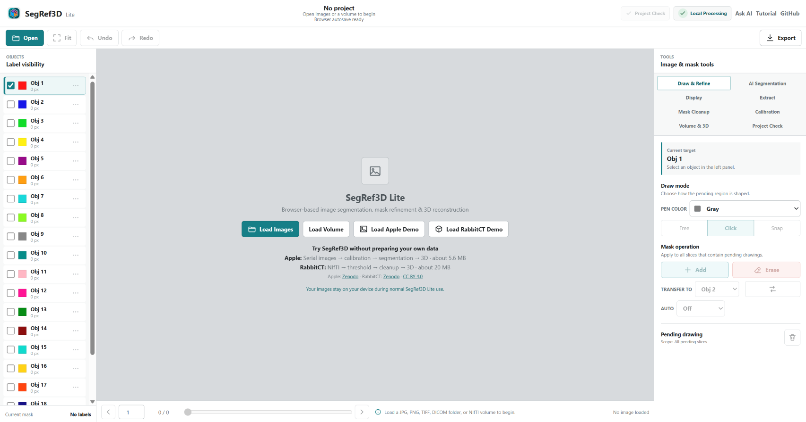

## 2. Open the Apple Demo and navigate the slices

Select `Load Apple Demo` in the center. There is no separate selection screen; the 20-image `Apple Demo - Kanzi 84` sequence loads directly.

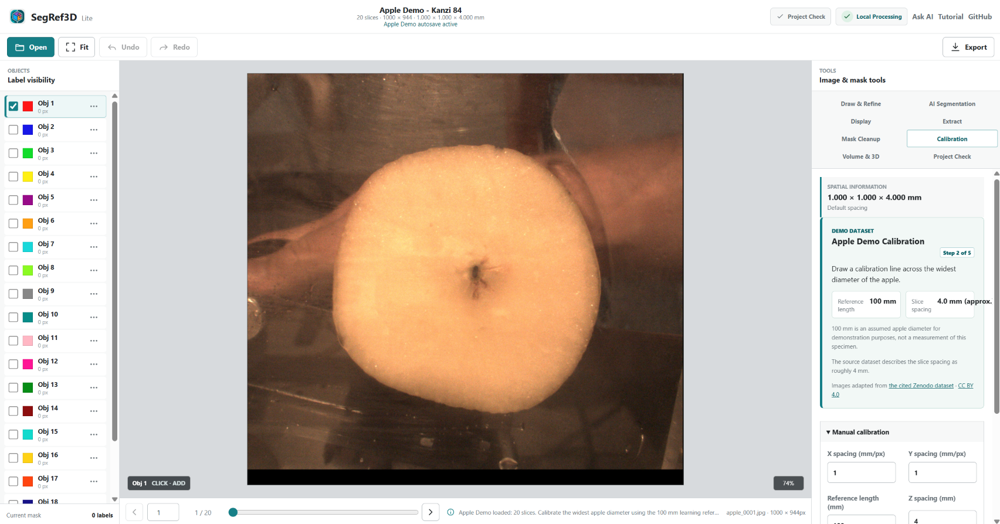

Use a plain mouse wheel over the canvas to move through the slices. You can also use the slider or Previous/Next buttons below the canvas. Inspect several slices and find frames where the Apple, Stem, and Core are clear.

## 3. Calibration

After the Apple Demo loads, `Calibration` opens in `Image & mask tools` with these presets:

- `Reference length`: **100 mm**
- `Z spacing`: **4.0 mm (approx.)**

You do not need to re-enter the values. Select `Draw Reference Line`, then click two points across the widest apple diameter. A guide line follows the pointer after the first point.

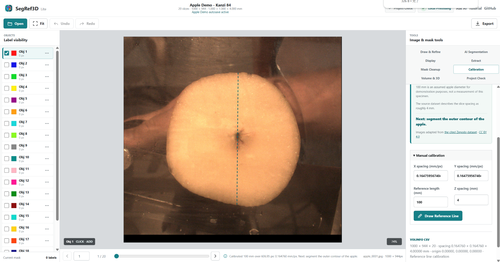

The resulting X/Y spacing and Z spacing determine physical dimensions in volume measurements, NIfTI, 3D Preview, and STL.

> **About the demo values:** 100 mm is an assumed apple diameter for learning the calibration workflow, not a measurement of this specimen. The source dataset describes the slice spacing as roughly 4 mm.

## 4. Open AI Tracking Setup

Select `Seg Anything` in the top bar to open the workflow.

Select `Edit Setup` to open `AI Tracking Setup`. This is where you register object names, Tracking Ranges, and Box Prompts.

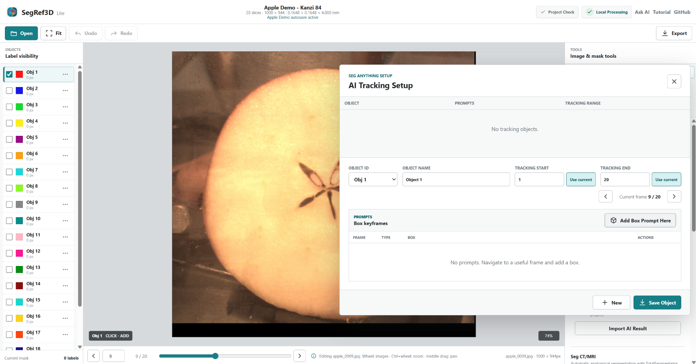

A Tracking Range is the first and last slice on which the structure should be tracked. Keep the dialog open while navigating with its frame buttons, the mouse wheel, or `F`/`R`, then select `Use current` beside `Tracking start` or `Tracking end`. A Box Prompt frame must be inside its Tracking Range.

> Some provided screenshots show the default names `Object 1` and `Object 2`. For this tutorial, replace the `Object name` values with `Apple`, `Stem`, and `Core`. The object IDs and display colors do not change.

## 5. Register Obj 1 = Apple

1. Set `Object ID` to `Obj 1` and `Object name` to `Apple`.
2. Move to a slice where the whole apple boundary is clear.
3. Inspect the sequence and set `Tracking start` and `Tracking end` to the first and last slices containing the apple.
4. Select `Add Box Prompt Here`.
5. Click two opposite corners of a box that contains the whole apple.
6. Select `Save Object`.

The box does not need to touch the boundary tightly. Make sure the full target is inside it.

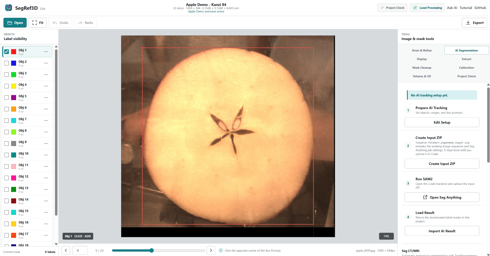

After saving, the upper table shows Obj 1, its prompt count, and its Tracking Range.

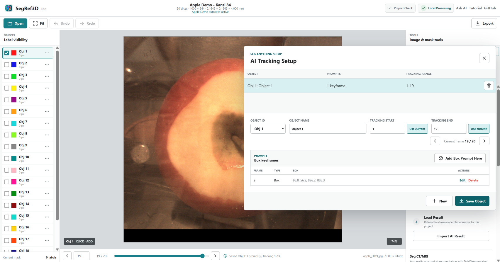

## 6. Register Obj 2 = Stem

1. Select `New`. SegRef3D chooses the next unused ID, `Obj 2`.
2. Set `Object name` to `Stem`.
3. Move to a slice where the stem is clear.
4. Set `Tracking start` and `Tracking end` to the slices containing the stem.
5. Select `Add Box Prompt Here` and enclose the whole stem.
6. Select `Save Object`.

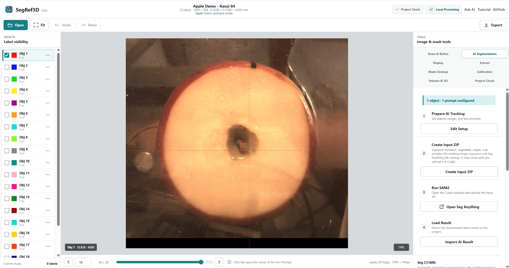

## 7. Register Obj 3 = Core and review the job

1. Select `New` again to create `Obj 3`.
2. Set `Object name` to `Core`.
3. Move to a slice where the star-shaped core is clear.
4. Set the slice range containing the Core.
5. Enclose the full Core with `Add Box Prompt Here`, then select `Save Object`.

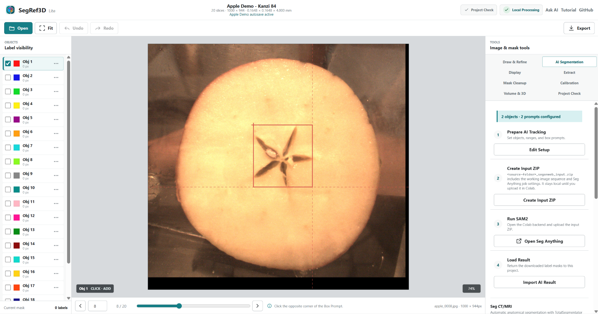

When the workflow summary reads `3 objects · 3 prompts configured`, the job is ready for Colab. Reopen `Edit Setup` if you need to review each prompt and Tracking Range.

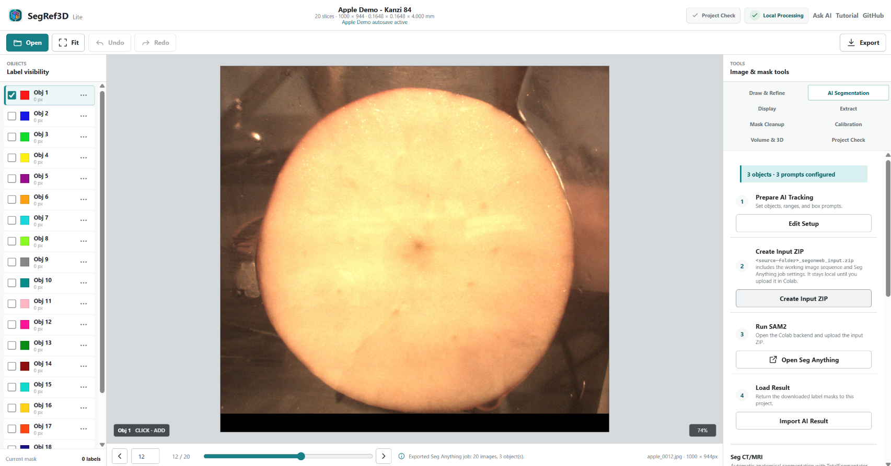

## 8. Create Input ZIP

Close `AI Tracking Setup` and select `Create Input ZIP` in the Seg Anything workflow. The Apple Demo downloads:

`Apple Demo - Kanzi 84_segonweb_input.zip`

This ZIP contains the 20 working images and the Apple, Stem, and Core Box Prompts and Tracking Ranges. Creating the ZIP does not upload it anywhere.

## 9. Run Seg Anything in Google Colab

### 9-1. Open Colab

Select `Open Seg Anything`. Read the Google Colab notice and, if you wish to continue, select `Continue to Seg Anything`. You can also [open Seg Anything directly](https://satorumuro.github.io/SegRef3D/ColabNotebooks/segonweb.html).

### 9-2. Select a GPU runtime

In Colab, open `Runtime` → `Change runtime type`, select `T4 GPU` as the hardware accelerator, and save. Another assigned NVIDIA GPU can also be used.

### 9-3. Run all cells and upload the Input ZIP

Choose `Runtime` → `Run all`. When the file upload control appears in the first executable cell, select the `*_segonweb_input.zip` created above.

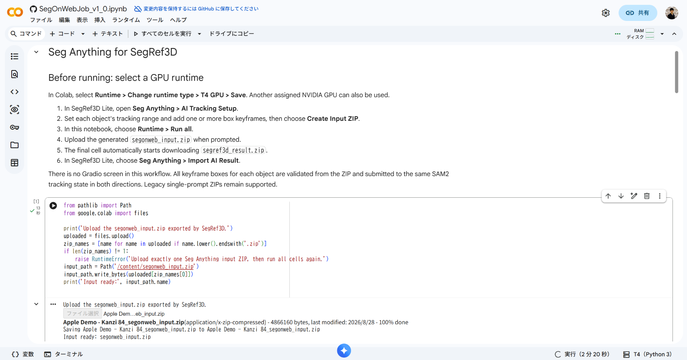

The notebook prepares SAM2 and tracks the three objects in sequence. Processing commonly takes several minutes, but the time varies with Colab load, the assigned GPU, and the runtime. Leave the notebook open while it runs.

When `Segmentation complete` appears, the final cell automatically starts downloading `segref3d_result.zip`. If the download does not start, run only the final download cell again.

> **Data handling:** Normal SegRef3D Lite operations run on your device. Seg Anything is different: you explicitly upload the Input ZIP containing the working images to your own Google Colab runtime. Confirm that this is permitted by your institution's research-data and privacy policies before using research or medical data. This workflow does not upload images to a SegRef3D-operated server.

## 10. Return the AI Result and refine the masks

### 10-1. Import the Result ZIP

Return to SegRef3D Lite, select `Import AI Result` in the Seg Anything workflow, and choose `segref3d_result.zip`. If the project already contains masks, SegRef3D asks before replacing the current label masks.

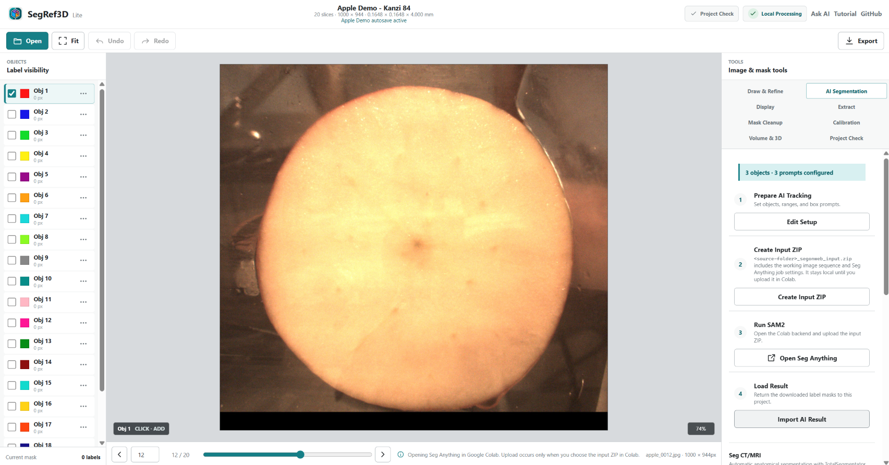

After import, the Apple, Stem, and Core masks and object names appear in the Objects panel.

### 10-2. Add a missing region

1. Open `Draw & Refine`.
2. Select the object to edit in the Objects panel.
3. Choose the `Click` draw mode.
4. Set `Auto` to `Add`.
5. Left-click around the missing region, then right-click the final point.

The right-clicked point becomes the endpoint, joins the start, and applies the enclosed region to the current slice.

| Outline an Add region | After Add |
| --- | --- |
| 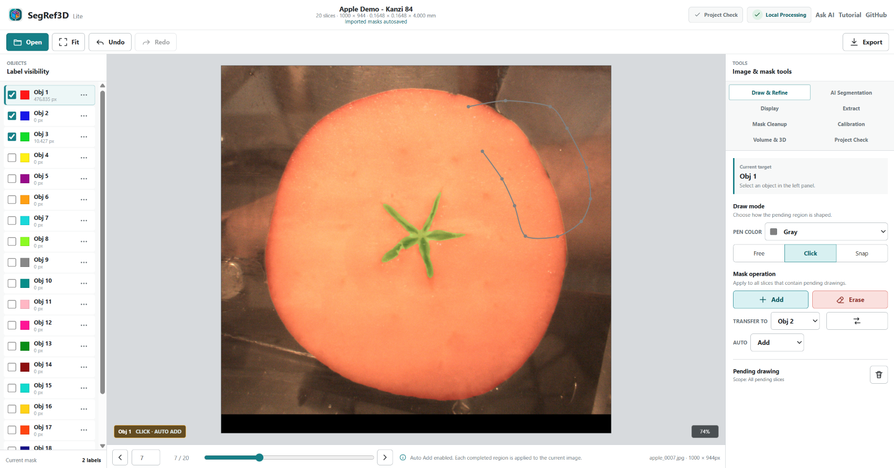 |  |

### 10-3. Erase an unwanted region

Set `Auto` to `Erase`, left-click around the unwanted area, and right-click the final point. The enclosed region is removed from the current slice.

| Outline an Erase region | After Erase |
| --- | --- |
| 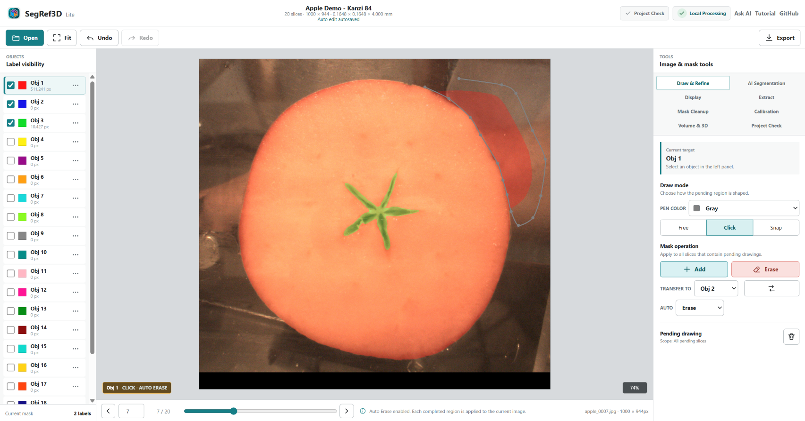 |  |

This is the central SegRef3D workflow: AI creates most of the segmentation, and the researcher reviews and corrects the parts that need attention.

### 10-4. Switch objects

Select `Obj 1: Apple`, `Obj 2: Stem`, or `Obj 3: Core` in the Objects panel to change the editing target. The checkbox at the left controls visibility. Each object can be inspected and refined independently on the same image sequence.

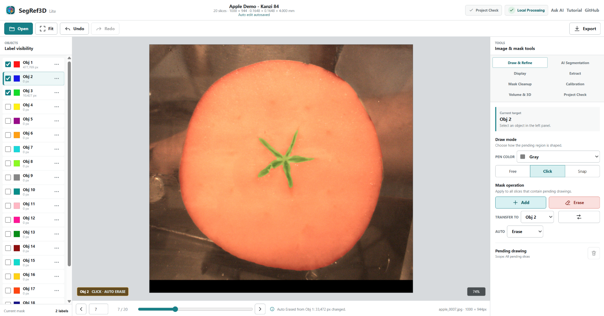

## 11. Choose an export

| Goal | Export |
| --- | --- |
| Use multiple objects as 3D surfaces | `STL` |
| Resume later in SegRef3D Lite | `Project ZIP` |
| Save image + mask for future custom-model training | `Training Data ZIP` |
| Send a label volume to 3D Slicer or similar software | `NIfTI Labelmap` |
| Save mask images | `Label PNG` or `TIFF` |
| Save object volume values | `Volume Statistics CSV` |

### 11-1. Preview Apple, Stem, and Core in 3D

1. Enable visibility for Apple, Stem, and Core in the Objects panel.
2. Open `Volume & 3D` under `Image & mask tools`.
3. Set STL `Slice interpolation` to `5x`.
4. Set `Objects` to `Visible objects`.
5. Select `Preview 3D`.

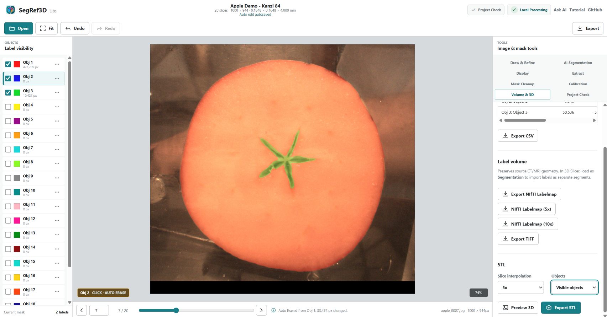

In the 3D Preview, drag to rotate and use the mouse wheel to zoom. The sliders at the right control each object's opacity. Reducing the Apple opacity makes the spatial relationship of the Stem and Core easier to inspect.

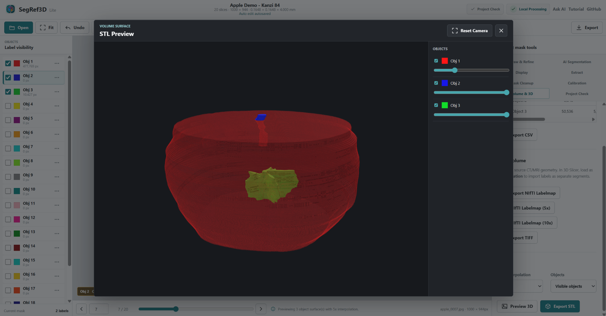

### 11-2. Export STL

Close the preview, keep `Objects = Visible objects`, and select `Export STL`.

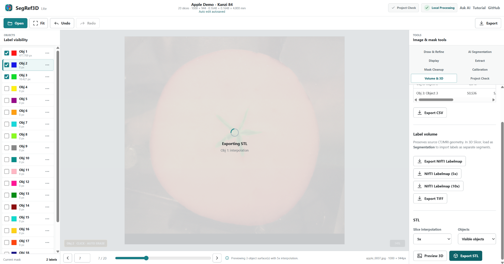

For multiple objects, SegRef3D downloads `Apple Demo - Kanzi 84_STL_5x_<timestamp>.zip`. The ZIP contains separate STL files for Obj 1, Obj 2, and Obj 3. STL is a surface-model format for 3D viewers, CAD, and 3D-printing workflows.

### 11-3. Finish by saving a Project ZIP

Choose `Export` → `Project ZIP` in the top bar.

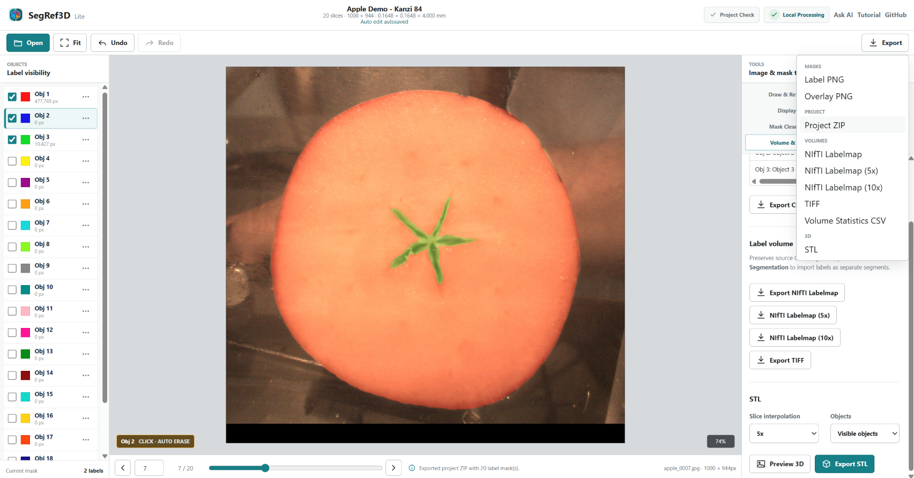

`Apple Demo - Kanzi 84_SegRef3D_Project_<timestamp>.zip` stores label masks, calibration, object names, display settings, and the Seg Anything setup. It does not include the source images.

To resume, first select `Load Apple Demo`, then use `Load Masks` → `Replace` → `ZIP / Project ZIP` to open the saved ZIP. Browser autosave is helpful, but **finish the session by saving a Project ZIP** as a portable work record.

### 11-4. Save a training case

After finishing segmentation review, choose `Export` → `Training Data ZIP`. SegRef3D Lite saves one case containing geometry-matched image channel(s), a labelmap that preserves the current Obj IDs, and `manifest.json` with geometry and privacy policy. RGB sources such as the Apple Demo produce separate R/G/B channels; scalar or grayscale sources produce one channel.

Generation is browser-local and does not upload data to a SegRef3D server. DICOM headers are excluded, but burned-in text, facial or unique anatomy, and user-entered object names may still identify someone. Do not treat the Training ZIP as anonymized. SegRef3D Lite does not yet train a model; this ZIP is a versioned case format for future custom-model training.

## 12. Other useful tools

SegRef3D Lite also provides Threshold/RGB extraction, Mask Cleanup, mask interpolation, NIfTI Labelmap, TIFF, Label PNG, Overlay PNG, and Volume Statistics CSV. This getting-started tutorial focuses on the AI workflow. See the [SegRef3D Lite documentation](../lite-web/README.md) and the [detailed Seg Anything guide](TutorialSegOnWebEN.md) for additional options and troubleshooting.

## 13. What you learned

- Loaded a serial image sequence in SegRef3D Lite
- Calibrated image scale and Z spacing
- Defined Apple, Stem, and Core as separate objects with Box Prompts
- Ran SAM2 segmentation on a Google Colab GPU
- Imported the AI masks back into SegRef3D Lite
- Refined masks with Add and Erase
- Switched among three independently editable objects
- Previewed Apple, Stem, and Core together in 3D
- Exported separate object surfaces as STL
- Saved a Project ZIP

You have completed the core SegRef3D Lite workflow: **define targets → AI segmentation → human refinement → quantitative 3D output**.

## 14. Demo data

Apple Demo images are adapted from: Schut DE, Trull AK, Couvée M. *Dataset of CT scans, slice photographs, and visual browning scores of 120 'Kanzi' apples.* Zenodo. [https://doi.org/10.5281/zenodo.8167285](https://doi.org/10.5281/zenodo.8167285)

Source dataset license: [CC BY 4.0](https://creativecommons.org/licenses/by/4.0/). Images were selected, cropped, resized to 1000 × 944 pixels, and JPEG-compressed for the SegRef3D demo. The original data providers do not endorse SegRef3D.

---

[日本語版](TutorialSegRef3DLiteJP.md) · [Detailed Seg Anything guide](TutorialSegOnWebEN.md) · [Registration](Registration.md)
