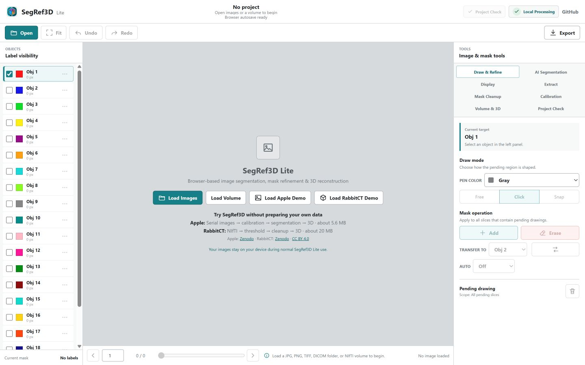
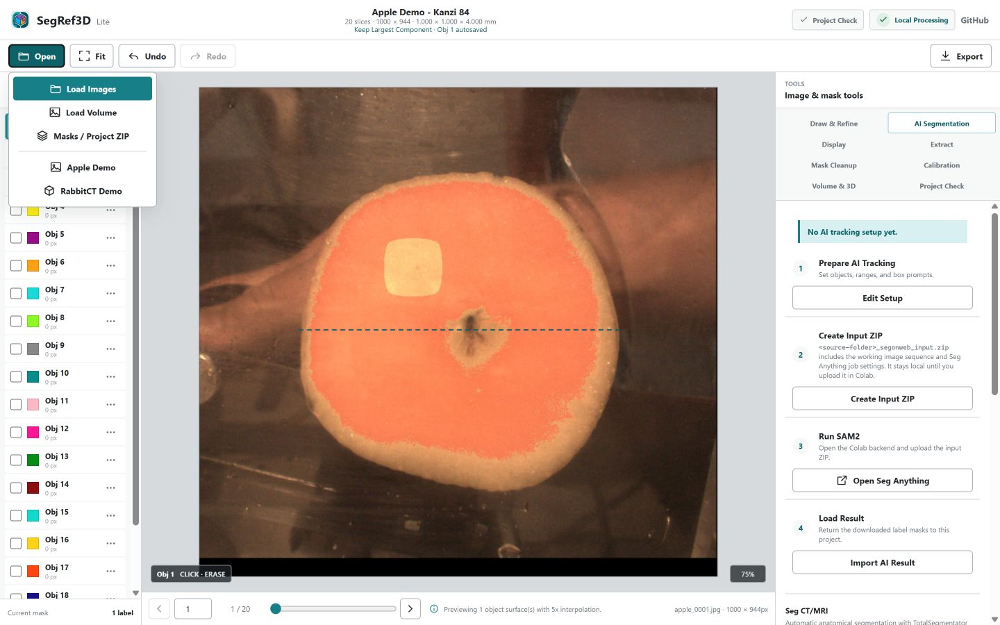
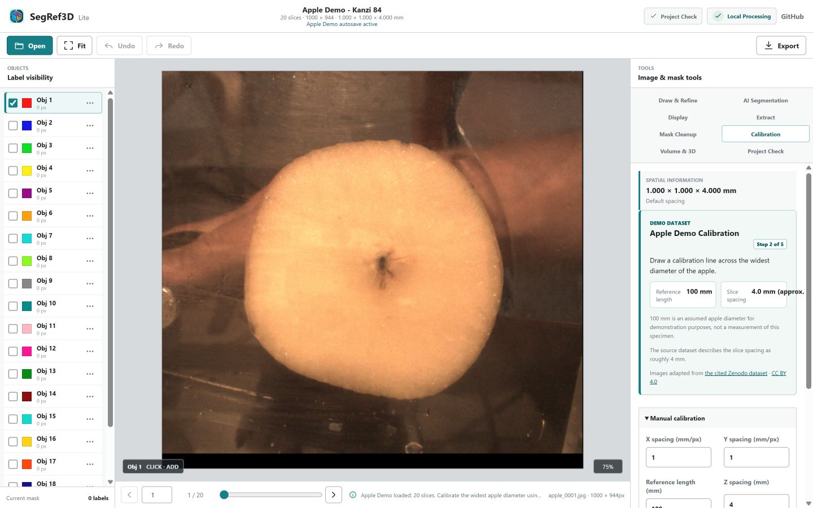
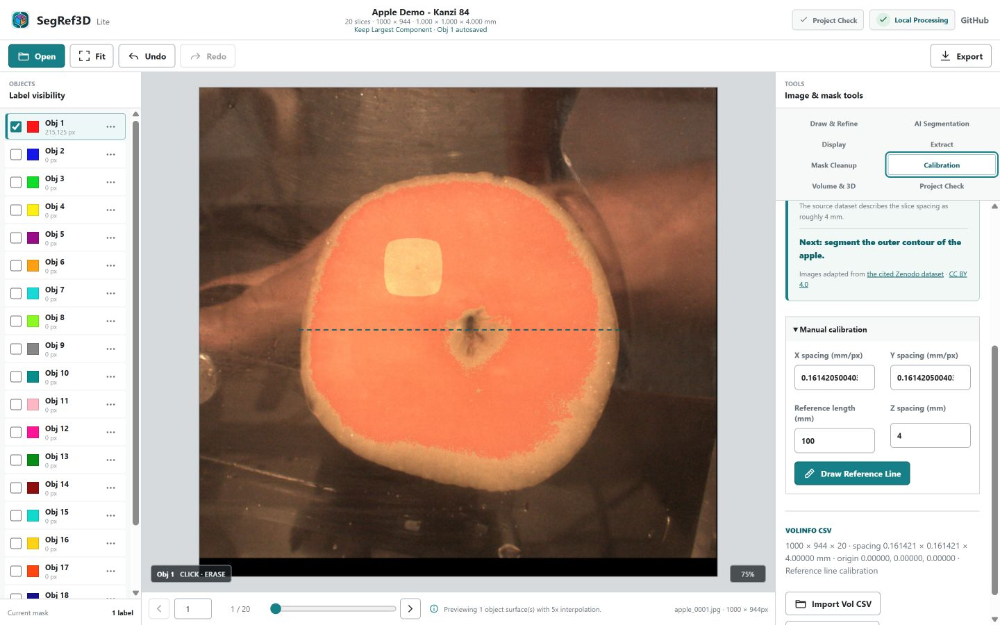
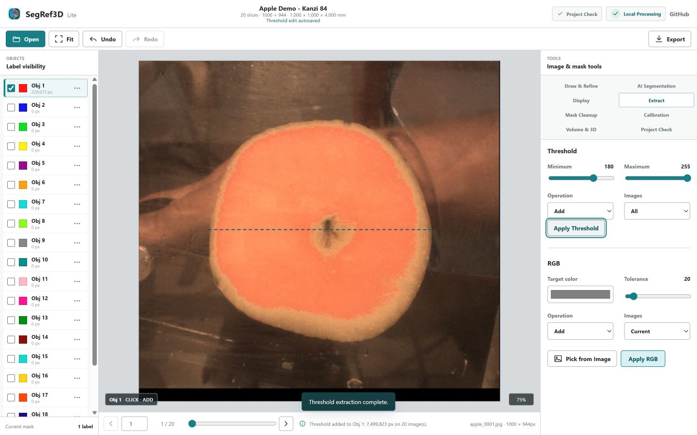
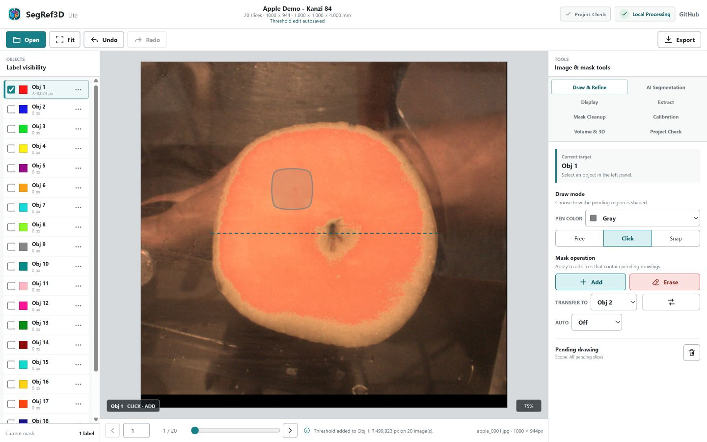
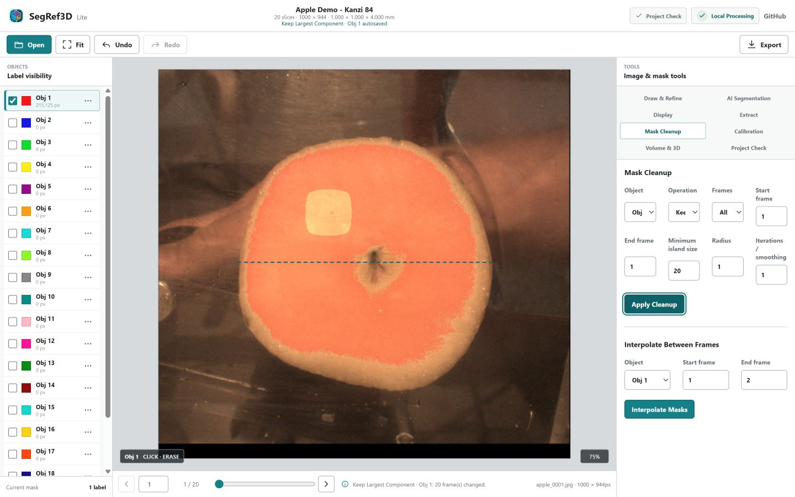
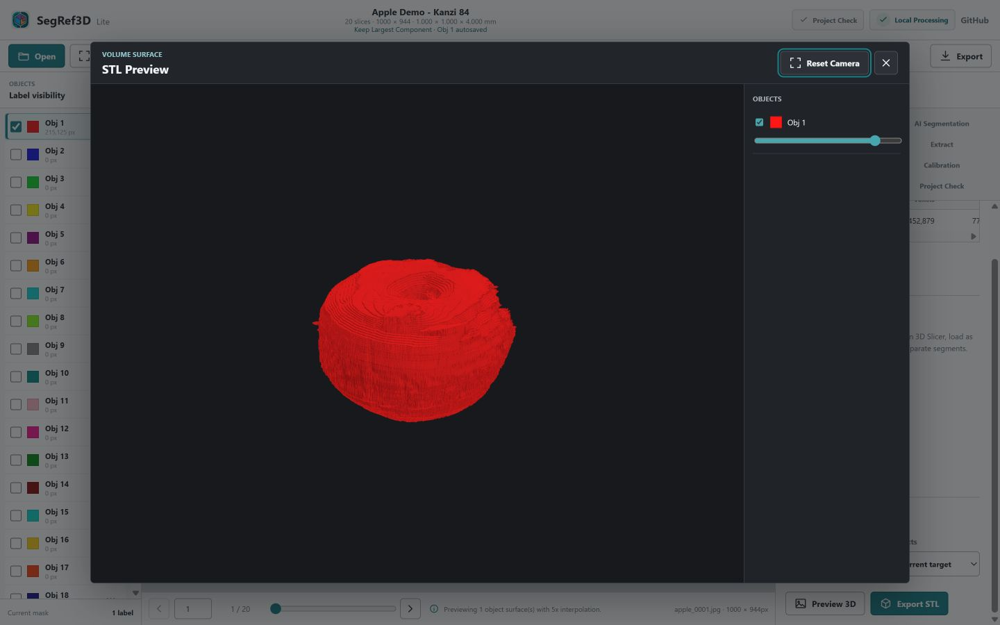
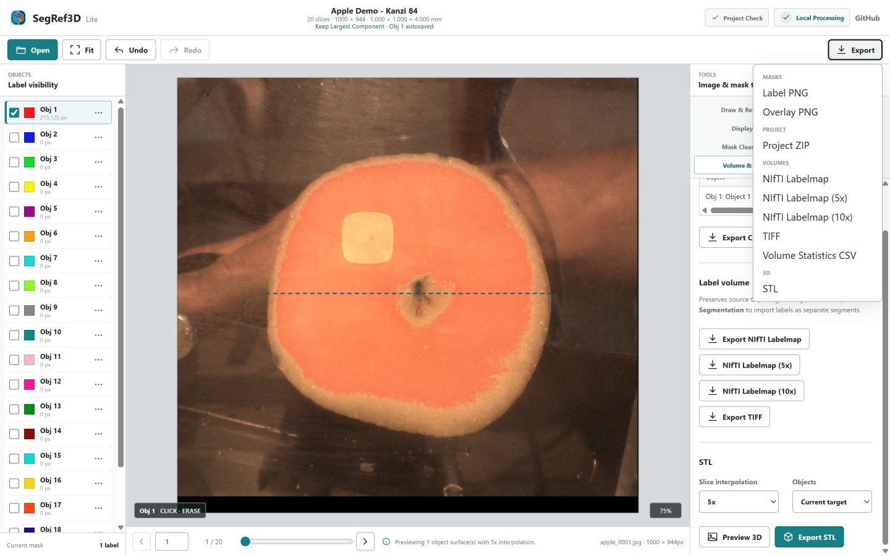
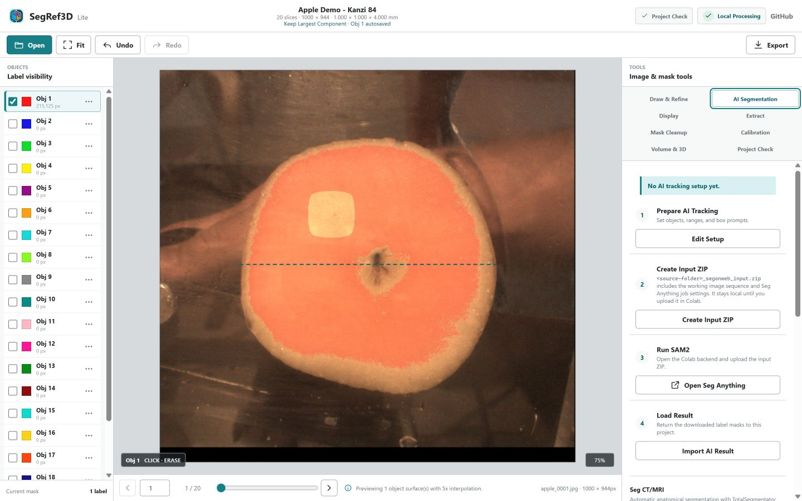

# SegRef3D Lite 基本操作チュートリアル

このガイドでは、20枚の**Apple Demo**を使って、画像の読込、calibration、mask作成、修正、3D preview、保存までを一周します。Python、コマンド操作、ソフトウェアのインストールは不要です。

> このチュートリアルは操作練習用です。作成するapple maskは研究用の完全なsegmentationを意図したものではありません。

## 0. SegRef3D Liteとは

SegRef3D LiteはSegRef3Dの標準的な利用入口です。Windows、macOS、Linuxなどのモダンブラウザで動作し、JPG、PNG、TIFF、DICOM、NIfTIの表示とmask編集、calibration、measurement、3D reconstruction、NIfTI／TIFF／STL／CSV出力を行えます。通常の編集と出力はユーザー端末内で処理されます。

## 1. SegRef3D Liteを開く

[**Open SegRef3D Lite**](https://satorumuro.github.io/SegRef3D/lite-web/)

ChromeまたはEdgeは、画像フォルダ選択を含む操作を始める際の実用的な選択肢です。ほかのモダンブラウザでも利用できますが、フォルダ選択ダイアログの表示はブラウザによって異なります。

画面上部に画像操作、中央にcanvas、下部または横にObjects panelが表示されます。右上の`Local Processing`を押すと、処理場所の説明を確認できます。

## 2. Apple Demoを開く

中央の`Load Apple Demo`を押します。

`Apple Demo - Kanzi 84`の20枚の連続画像が読み込まれ、appleの断面と`1 / 20`のようなframe表示が現れます。

## 3. 画面の基本操作

- 上部の左右矢印またはcanvas下のslice controlで前後のframeへ移動します。
- 通常のmouse wheelで前後の画像へ移動します。
- `Ctrl`／`Command`を押しながらwheelを回すとzoomします。
- zoom中はmiddle mouse buttonを押しながらdragするとpanできます。
- `Target`またはObjects panelで編集対象を選びます。このガイドでは`Obj 1`を使います。
- `Fit` iconは画像全体をcanvasへ戻します。

## 4. Calibration

最も広いapple断面が見える中央付近のframeへ移動し、`Tools` → `Calibration`を開きます。Apple Demo guideには次の値が表示されます。

- `Reference length`: **100 mm**
- `Z spacing`: **4.0 mm (approx.)**

`Draw Reference Line`を押し、appleの最も広い径を横切るように2点をclickします。1点目の後は補助線が表示されます。

**この100 mmは操作練習用に仮定した値であり、この標本を実測した値ではありません。** Source datasetではslice spacingがおよそ4 mmと説明されています。calibrationで得たmm/pxとZ spacingはmeasurement、volume、NIfTI、STLへ使用されます。

## 5. Obj 1を選ぶ

Objects panelまたは上部の`Target`で`Obj 1`を選び、visibilityをONにします。1枚のlabel maskでは、0がbackground、1がObj 1です。SegRef3D Liteでは最大20 objectsを別々の色で扱えます。

## 6. Apple maskを作る

Apple Demoでは、明るい果肉と暗い背景の差を利用するThresholdが初回操作に向いています。

1. `Tools` → `Extract`を開きます。
2. Thresholdの`Minimum`を`180`、`Maximum`を`255`にします。
3. `Operation`を`Add`、`Images`を`All`にします。
4. `Apply Threshold`を押します。

この値はdemo用の開始点です。実データでは画像の濃度に合わせて調整してください。

## 7. Add／Eraseで修正する

Toolsを閉じ、上部のdraw modeを`Click`にします。左clickでapple外形に沿って点を置き、最後の点で**右click**すると、その点を終点として始点へ結ばれます。

- 描いた範囲をmaskへ加える: `Add`
- 描いた範囲をmaskから消す: `Erase`
- mask編集を戻す: `EDIT`のUndo icon
- 戻した編集をやり直す: `EDIT`のRedo icon

`LINE`のUndo／Redoは描画線だけを操作し、mask編集のUndo／Redoとは別です。

## 8. Mask Cleanup

Thresholdで背景の小さな明部も拾った場合は、代表的なcleanupとして次を使います。

1. `Tools` → `Mask Cleanup`を開きます。
2. `Object`を`Obj 1`にします。
3. `Operation`を`Keep Largest Component`にします。
4. `Frames`を`All Frames`にします。
5. `Apply Cleanup`を押します。

各frameの最大連結領域を残すため、apple本体から離れた小領域を整理できます。結果が意図と異なる場合はmask editのUndoで戻します。

## 9. 複数sliceを確認する

前後のframeへ移動し、赤いObj 1 overlayがapple外形へ沿っているか確認します。すべてを完全に整える必要はありません。今回の目的は、連続する2D masksが3D volumeへ変換される流れを理解することです。

## 10. 3D Preview

`Tools` → `Volume & 3D`を開き、STL sectionで次を選びます。

- `Slice interpolation`: `5x`
- `Objects`: `Current target`

`Preview 3D`を押します。2D masksがvoxel volumeとして積層され、surface previewが表示されます。

previewではdragで回転、wheelでzoomできます。`Reset Camera`で初期視点へ戻せます。

## 11. どの形式を保存するか

| やりたいこと | 推奨出力 |
| --- | --- |
| 後でSegRef3D Liteで作業を再開 | `Project ZIP` |
| 3D Slicer等へlabelとして渡す | `NIfTI Labelmap` |
| mask画像として保存 | `Label PNG`または`TIFF` |
| 3D surface modelとして利用 | `STL` |
| object volumeを表として保存 | `Volume Statistics CSV` |

上部の`Export` menu、または`Tools` → `Volume & 3D`から出力します。

## 12. Project ZIPを保存して再開する

`Export` → `Project ZIP`を選びます。Project ZIPには作業画像、label masks、表示・calibration設定などが含まれます。

再開するときは、`Open` → `Masks / Project ZIP`を選び、保存したProject ZIPを開きます。既存projectへmaskだけを読み込む場合は、表示される`Replace`／`Merge`を目的に合わせて選びます。

ブラウザautosaveは同じbrowser／deviceでmaskを補助的に復元しますが、browser dataの消去や環境変更に備え、**Project ZIPを明示的な作業バックアップとして保存してください。**

## 13. NIfTI／STL／CSV

- **NIfTI Labelmap**: 3D Slicer等でlabel／segmentationとして扱う用途です。
- **STL**: 3D surface modelとしてviewer、CAD、3D printing workflow等へ渡します。
- **Volume Statistics CSV**: objectごとのvoxel数、mm³、cm³、frame数を保存します。

NIfTIとSTLには、必要に応じてslice方向を5x／10x補間した出力もあります。基本操作では5x previewから始め、形状とcalibrationを確認してください。

## 14. AI Segmentation

基本編集はAIなしで完結します。必要な場合は2つのGoogle Colab workflowを利用できます。

### Seg Anything

任意構造をSAMベースでsegmentします。SegRef3D LiteでBox Prompt、Prompt Frame、Tracking Rangeを設定し、`Create Input ZIP` → Google Colab → `Import Result ZIP`の順に進みます。詳しくは[Seg Anything tutorial](TutorialSegOnWebJP.md)を参照してください。

### Seg CT/MRI

対応するCT/MRI NIfTIから既知の解剖構造をTotalSegmentatorでsegmentします。anatomyを選択し、request ZIPをGoogle Colabへ送り、result ZIPを戻します。

## 15. 研究データの取り扱い

通常のSegRef3D Liteでは、画像表示、mask編集、calibration、measurement、NIfTI／TIFF export、STL generationはブラウザ内・端末内で処理されます。通常操作だけで研究画像がSegRef3Dの外部serverへ自動uploadされるものではありません。

一方、`Seg Anything`と`Seg CT/MRI`でGoogle Colabを利用する場合は、ユーザー自身が作業画像または元NIfTIを含むjob dataをGoogle Colab runtimeへ明示的にuploadします。研究・医用データを扱う場合は、所属施設のdata handling policyでGoogle Colabの利用が許可されていることを確認してください。

## 16. Troubleshooting

### Images do not load

JPG、PNG、TIFF、DICOM（拡張子あり／なし）、NIfTI（`.nii`／`.nii.gz`）を確認してください。DICOM folderに複数seriesがある場合はseries選択が表示されます。

### Browser becomes slow

大きなvolume、多数の高解像度画像、5x／10x 3D処理はmemoryを多く使います。不要なtabを閉じ、まず1xまたは対象objectだけでpreviewしてください。

### 3D model is stretched or compressed

X/Y spacing、Z spacing、calibration lineを確認してください。DICOM／NIfTIではsource geometryが使われます。

### Browser was closed

同じbrowserで同じ画像を読み込むとbrowser autosaveからmaskが戻る場合があります。確実な再開には保存済みProject ZIPを使用してください。

### I want to use 3D Slicer

`NIfTI Labelmap`を推奨します。3D SlicerではSegmentationとして読み込むとobject labelsをsegmentsとして扱えます。

## Demo data

Apple Demo images are adapted from: Schut DE, Trull AK, Couvée M. *Dataset of CT scans, slice photographs, and visual browning scores of 120 'Kanzi' apples.* Zenodo. [https://doi.org/10.5281/zenodo.8167285](https://doi.org/10.5281/zenodo.8167285)

Source dataset license: [CC BY 4.0](https://creativecommons.org/licenses/by/4.0/). Images were selected, cropped, resized to 1000 × 944 pixels, and JPEG-compressed for the SegRef3D demo. The original data providers do not endorse SegRef3D.

---

[English version](TutorialSegRef3DLiteEN.md) · [Seg Anything](TutorialSegOnWebJP.md) · [Registration](Registration.md)
